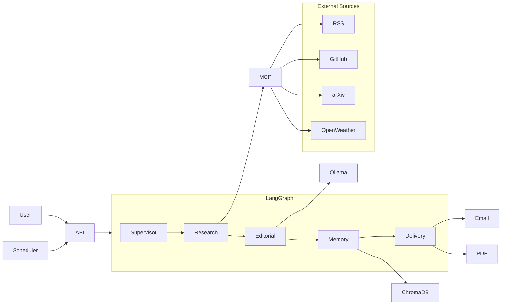

# NewsMind AI

An autonomous personal intelligence agent that proactively gathers, personalizes, and delivers daily intelligence briefs based on your interests.

## Architecture

```
Scheduler → Supervisor Agent → Research Agent → MCP Tools → Editorial Agent → Memory Agent → Delivery Agent → Email
```

- **Research Agent** decides *what* to collect — never contains hardcoded URLs
- **MCP Tools** dynamically load sources from `backend/config/sources.yaml`
- **LangGraph** orchestrates the multi-agent workflow with conditional routing
- **ChromaDB** stores long-term memory (interests, reading history, feedback)



## Tech Stack

| Layer | Technologies |
|-------|-------------|
| Frontend | React, Vite, Tailwind CSS, Axios |
| Backend | FastAPI, SQLAlchemy, SQLite |
| AI | LangGraph, LangChain, Ollama |
| MCP | Model Context Protocol (stdio server) |
| Memory | ChromaDB |
| Scheduler | APScheduler |
| Delivery | ReportLab (PDF), Gmail SMTP |

Multi-Agent Workflow

NewsMind AI is built as a multi-agent system using LangGraph. Each agent has a single responsibility, making the workflow modular, scalable, and easy to maintain.

1. Supervisor Agent

Role: Workflow Controller

The Supervisor Agent is the entry point of the LangGraph workflow. It is responsible for coordinating the execution of all other agents and ensuring they run in the correct order.

Responsibilities

Starts the newspaper generation workflow
Validates the current workflow state
Decides the next agent to execute
Handles conditional routing if additional processing is required
Marks workflow completion

Input

User request
User preferences
Workflow state

Output

Updated workflow state passed to the Research Agent
2. Research Agent

Role: Information Collection Agent

The Research Agent decides what information needs to be collected based on the user's interests and preferences.

It does not contain hardcoded websites or APIs. Instead, it delegates information retrieval to the MCP Tools layer.

Responsibilities

Reads user interests
Searches relevant news
Retrieves research papers
Finds GitHub trending repositories
Collects conferences
Finds hackathons
Retrieves coding competitions
Collects learning resources
Retrieves weather information
Adds career tips
Adds interview preparation questions
Adds daily inspirational quotes
Removes duplicate articles
Filters excluded topics

Input

User interests
Preferred news sources
Preferred language
Excluded topics
User city

Output

A structured list of articles ready for editorial processing.

3. MCP Tools

Role: Dynamic Data Retrieval Layer

The MCP (Model Context Protocol) layer performs the actual data collection.

Unlike traditional systems, sources are configured in sources.yaml, meaning new websites can be added without modifying Python code.

Responsibilities

Search RSS feeds
Search GitHub repositories
Retrieve arXiv research papers
Fetch weather
Search conferences
Search hackathons
Search coding competitions
Retrieve learning resources
Generate PDFs
Send emails

Advantages

Easily extensible
No hardcoded URLs
Configurable source registry
Supports fallback sources
4. Editorial Agent

Role: Newspaper Editor

The Editorial Agent transforms raw information into a readable newspaper.

Instead of simply displaying search results, it organizes, cleans, and structures the collected information.

Responsibilities

Groups articles into sections
Removes redundant content
Generates concise summaries
Creates newspaper layout
Organizes articles for readability
Uses the LLM to improve presentation

Input

Collected articles from the Research Agent.

Output

A structured newspaper ready for delivery.

5. Memory Agent

Role: Long-Term Personalization

The Memory Agent stores user interactions in ChromaDB so future editions become increasingly personalized.

Responsibilities

Store user interests
Store reading history
Store user feedback
Save preferred sources
Store article embeddings
Enable semantic search
Improve future recommendations

Technology

ChromaDB
Ollama Embeddings
all-minilm embedding model
6. Delivery Agent

Role: Content Delivery

The Delivery Agent is responsible for generating the final deliverables and sending them to the user.

Responsibilities

Generate PDF newspaper
Create HTML email
Attach PDF
Send email via Gmail SMTP
Record delivery status
Store generated reports

Output

Personalized PDF newspaper
HTML email
Delivery confirmation

## Quick Start

### Prerequisites

- Python 3.11+
- Node.js 20+
- [Ollama](https://ollama.ai) with `qwen2.5:7b` and `all-minilm:latest` models

### Backend

```bash
cd backend
cp .env.example .env          # Edit with your API keys
pip install -r requirements.txt
cd ..
uvicorn backend.main:app --reload --port 8000
```

### Frontend

```bash
cd frontend
npm install
npm run dev
```

Open http://localhost:5173

### Database Initialization

Tables are created automatically on first startup via SQLAlchemy `init_db()`.

### Scheduler

The APScheduler starts automatically with the backend. It checks every minute for users whose delivery time matches (ist).

### MCP Server (standalone)

```bash
python -m backend.mcp.server
```

### Tests

```bash
pip install -r backend/requirements.txt
pytest tests/ -v
```

### Docker

```bash
cd docker
docker compose up --build
```

## Environment Variables

Copy `backend/.env.example` to `backend/.env`:

| Variable | Description | Required |
|----------|-------------|----------|
| `JWT_SECRET` | Secret for JWT signing | Yes (production) |
| `OLLAMA_URL` | Ollama API endpoint | Default: `http://localhost:11434` |
| `DEFAULT_LLM_MODEL` | LLM model name | Default: `qwen2.5:7b` |
| `EMBEDDING_MODEL` | Embedding model | Default: `all-minilm:latest` |
| `OPENWEATHER_API_KEY` | Weather data | Optional |
| `SMTP_HOST/USER/PASSWORD` | Email delivery | Optional |
| `CHROMA_DB_PATH` | ChromaDB storage | Default: `./chromadb_data` |

## Adding News Sources

Edit `backend/config/sources.yaml` — no Python changes required:

```yaml
- id: my_source
  name: "My Source"
  category: news
  type: rss_search
  template: "https://example.com/search?q={query}"
  priority: 5
  credibility: 0.8
  enabled: true
```

## Project Structure

```
newsmind/
├── backend/
│   ├── agents/          # LangGraph agent nodes
│   ├── api/             # FastAPI routers
│   ├── config/          # sources.yaml registry
│   ├── graph/           # LangGraph workflow
│   ├── mcp/             # MCP tools + server
│   ├── scheduler/       # APScheduler jobs
│   └── utils/           # Security, sanitization, logging
├── frontend/            # React dashboard
├── docker/              # Docker Compose configs
└── tests/               # Test suites
```

## Verification Checklist

- [ ] Backend starts at http://localhost:8000/api/health
- [ ] Frontend loads at http://localhost:5173
- [ ] Register → Login → Onboarding flow works
- [ ] Manual report generation from Dashboard
- [ ] PDF download with authentication
- [ ] Preferences CRUD (interests, sources, excluded topics)
- [ ] Schedule creation/deletion
- [ ] Ollama running for editorial summarization
